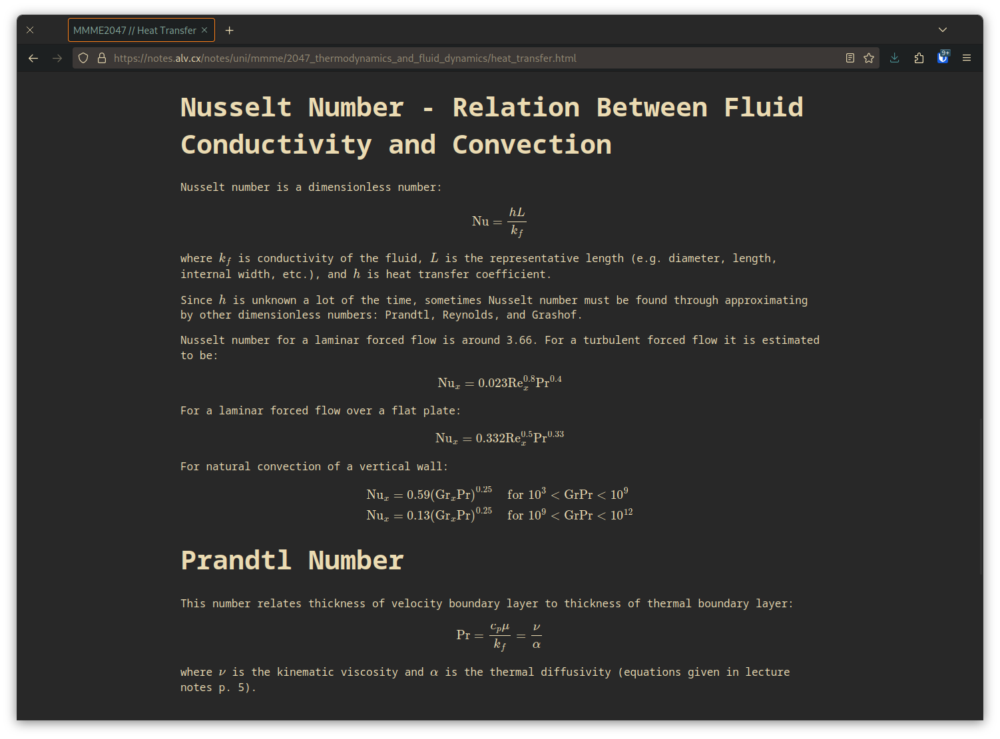

# :beaver: gronk

Formerly notes2web.

View your notes as a static HTML site. Powers [notes.alv.cx](https://notes.alv.cx).




## Why?

- View notes as a website, on any device
- Easily share notes
- Powered by Pandoc, and therefore supports [Pandoc's markdown](https://pandoc.org/MANUAL.html#pandocs-markdown) (I mainly care about equations)
- [flatnotes](https://github.com/Dullage/flatnotes) is cool but I really would rather type my notes in Vim
- Lightweight HTML generated
- Minimal JavaScript


## Install

### Docker

Run the following, modifing the `-v` arguments as needed to mount the correct folders and
setting the value of `ARCH` to either `amd64` or `arm64` as appropriate.

```
docker build . -t gronk --build-arg ARCH=amd64 
docker run -v ./n:/usr/src/app/notes -v ./web:/usr/src/app/web gronk
```

#### Compose

A [docker compose file](./docker-compose.yml) file has been provided.

Set the following environment variables (or create a .env file) and run `docker compose up`:

- `ARCH`
- `SOURCE`
- `OUTPUT`

### Locally

0. Install [Pandoc](https://pandoc.org/index.html) and [Pip](https://github.com/pypa/pip), python3-dev, and a C compiler
1. `sudo make install`

## Other Things to Know

- gronk indexes [ATX-style headings](https://pandoc.org/MANUAL.html#atx-style-headings) for
  searching
- gronk looks for the plaintext file `LICENSE` in the root directory of your notes


## Custom Directory Index and Metadata

To add custom content to a directory index, put it in a file called `readme.md` under the directory.

You can set the following frontmatter variables to customise the directory index of a directory:

| variable               | default value  | description                                                                                |
|------------------------|----------------|--------------------------------------------------------------------------------------------|
| `blog`                 | `false`        | enable [blog mode](#blog-mode) for this directory                                          |
| `tags`                 | `[]`           | list of tags, used by search and inherited by any notes and subdirectories                 |
| `uuid`                 | none           | unique id to reference directory, used for permalinking                                    |
| `content_after_search` | same as `blog` | show custom content in `readme.md` after search bar and directory index                    |
| `automatic_index`      | `true`         | show the automatically generated directory index. required for search bar to function.     |
| `search_bar`           | `true`         | show search bar to search directory items. requires `automatic_index` (enabled by default) |


## Notes Metadata

gronk reads the following YAML [frontmatter](https://jekyllrb.com/docs/front-matter/) variables for metadata:

| variable         | description                                                                           |
|------------------|---------------------------------------------------------------------------------------|
| `author`         | The person(s) who wrote the article                                                   |
| `pub_date`       | (for blog mode) set the publish date of an article/post/note (MUST be RFC822 format)  |
| `tags`           | A YAML list of tags which the article relates to - this is used for browsing and also |
| `title`          | The title of the article                                                              |
| `uuid`           | A unique identifier used for permalinks.                                              |
| `lecture_slides` | a list of paths pointing to lecture slides used while taking notes                    |
| `lecture_notes`  | a list of paths pointing to other notes used while taking notes                       |

## Blog Mode

A directory can be turned into a blog by enabling blog mode.
This can be done by setting the `blog` variable to `true` in the `readme.md` [custom directory metadata](#custom-directory-index-and-metadata).

Notes under this directory will be published to a blog, whose feed is accesible at `https://notes.alv.cx/notes/<directory..>/feed.xml`.

When blog mode is enabled, it is required that the `base_url` property is set in the top level `readme.md` file.
Note that there should be no trailing slash.
If a `readme.md` file does not exist, then an empty one can be created:

```md
---
base_url: https://notes.alv.cx
---
```


## Permalinks

Permalinks are currently rather basic and requires JavaScript to be enabled on the local computer.
In order to identify documents between file changes, a unique identifier is used to identify a file.

This unique identifier can be generated using the `uuidgen` command in the `uuid-runtime` package or
`str(uuid.uuid())` in the `uuid` python package.

The included `n2w_add_uuid.py` will add a UUID to a markdown file which does not have a UUID in it
already.
Combine it with `find` to UUIDify all your markdown files (but make a backup first).

## Custom Styling

To completely replace the existing styling, set the environment variable `GRONK_CSS_DIR` to another directory with
a file called `styles.css`.

To add additional styling, the default styling will attempt to import `styles.css` from the root of the notes
directory.

To add additional content to the homepage, create a file called `readme.md` at the top level of your notes directory.
To set the HTML `title` tag, set `title` in the frontmatter of `readme.md`:

```markdown
---
title: "alv's notes"
---

# alv's notes

these notes are probably wrong
```

## CLI Usage

```
$ gronk.py notes_directory
```

Output of `gronk.py --help`:

```
usage: gronk.py [-h] [-o OUTPUT_DIR] [-F] notes

positional arguments:
  notes

options:
  -h, --help            show this help message and exit
  -o OUTPUT_DIR, --output-dir OUTPUT_DIR
  -F, --force           Generate new output html even if source file was modified before output
                        html
```

The command will generate a website in the `output-dir` directory (`./web` by default).
It will then generate a list of all note files and put it in `index.html`.

Then you just have to point a webserver at `output-dir`.

## Uninstall

```
# make uninstall
```

## Acknowledgements

Default synatx highlighting is based off [Pygments](https://pygments.org/)' default theme and
made using Pandoc v2.7.2.
I found the theme [here](https://github.com/tajmone/pandoc-goodies/blob/master/skylighting/css/built-in-styles/pygments.css).
